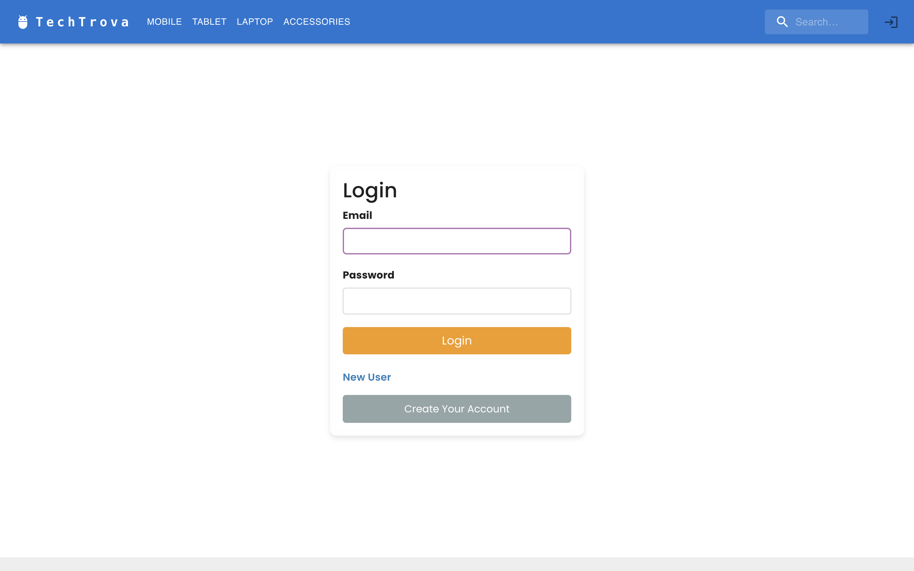
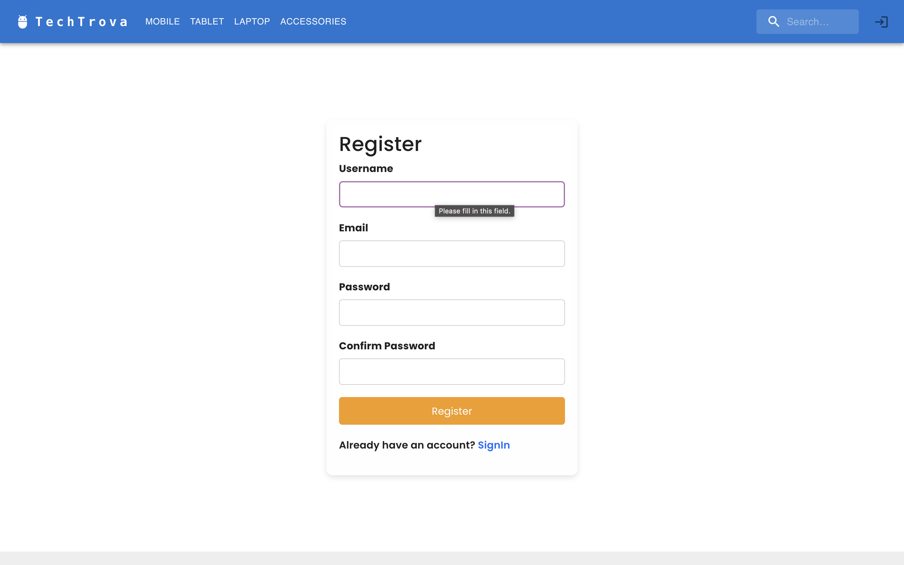
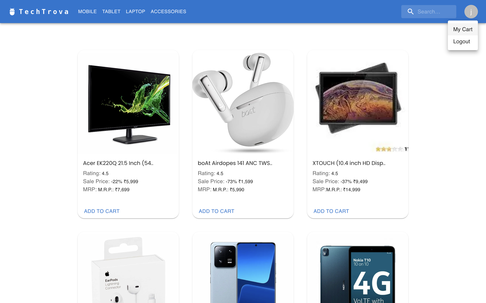
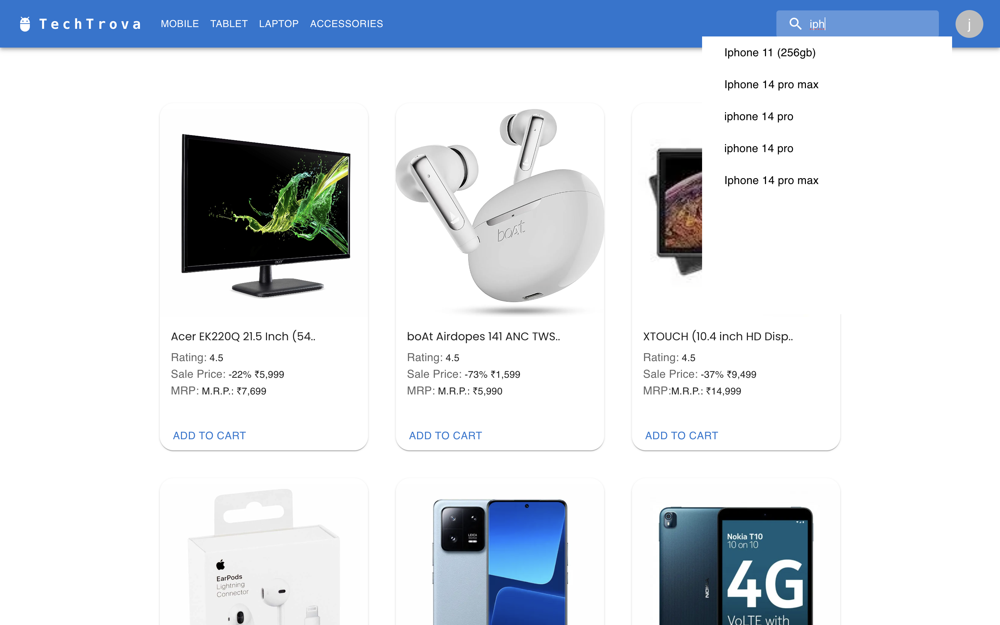
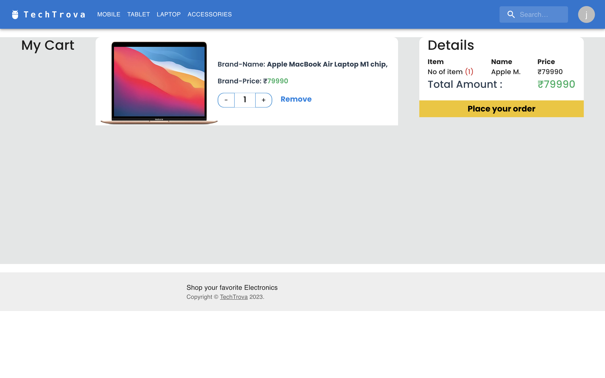
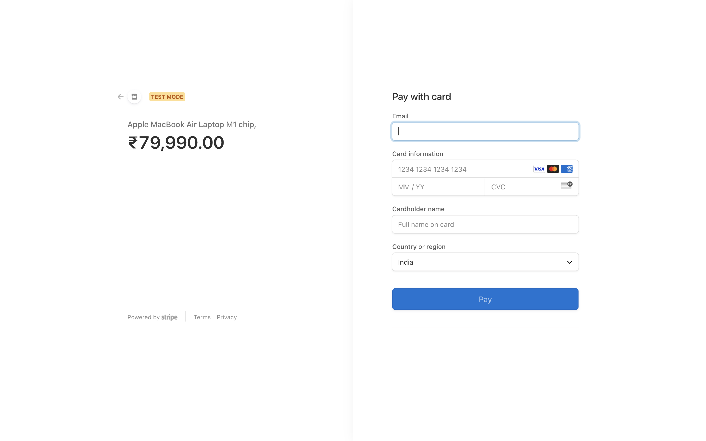
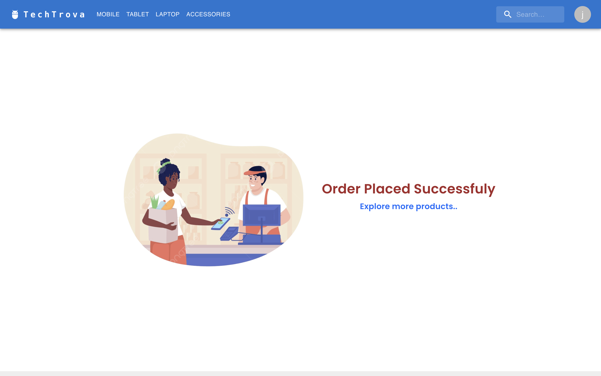
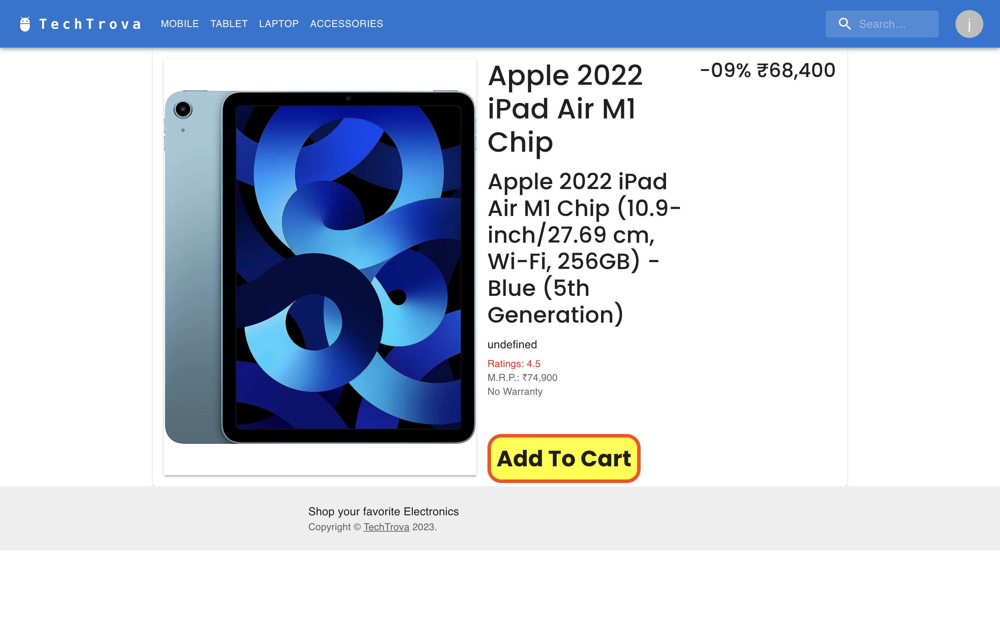

# TechTrova Project

TechTrova is an electronics store website that allows users to view and purchase electronivs products. It is built using the MERN stack, which includes Node.js, Express.js, React.js, Redux, and MongoDB. Additionally, JWT (JSON Web Tokens) authentication is implemented to enhance website security and provide a secure environment for user interactions.

## Project Features

- Seamless product browsing and viewing.
- Cart functionality for adding and managing selected products.
- Integrated secure payment processing through Stripe.
- Robust user authentication using JWT.
- Product search from all products.

## Live Link

[Click here to visit TechTrova](<https://tech-trova-6uui.vercel.app>)

## How to Use

1. Clone the repository:

```bash
git clone https://github.com/pjyotianwar/TechTrova.git
```

2. Install dependencies for both the server and client:

```bash
cd TechTrova
cd backend
npm install
# In new terminal
cd frontend
npm install
```

3. Add .env file and configure it with your stripe private key and mongo url.

4. Start the server and client:

```bash
# In the main project directory
npm run dev
```

5. Open your browser and visit `http://localhost:3000` to view and interact with TechTrova.

## Project Structure

- `frontend`: Contains the React.js frontend of the project.
- `backend`: Contains the Node.js and Express.js backend of the project.
- `Images`: Contains screeenshots of the project.

## Screenshots

















## Contributing

Pull requests are welcome. For major changes, please open an issue first to discuss what you would like to change.

## License

[MIT](LICENSE)

## Acknowledgements

- Special thanks to the developers and contributors of the libraries and technologies used in this project.